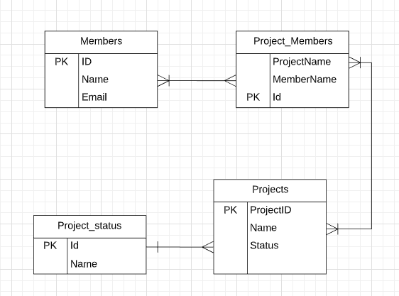
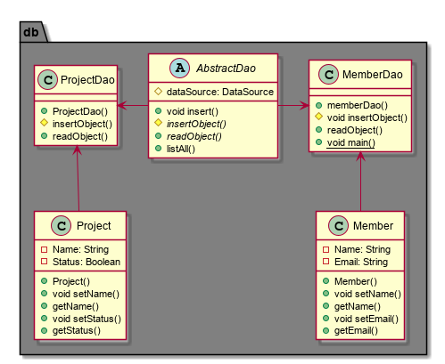
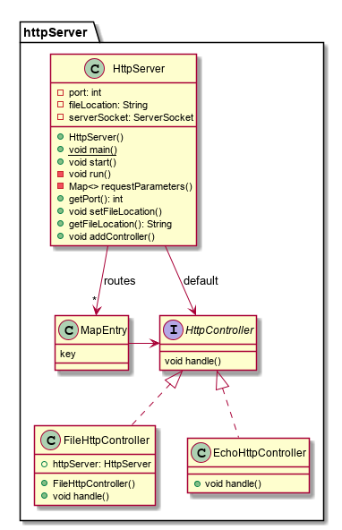

# PG203 Mappeinnlevering for gruppe <if(levert){karakter=A}>

This is a task managing program used to create tasks and assign them to members.
#### Features
* Add/remove/edit Task
* Add/remove Status categories
* Add/Remove/edit members
* add or remove members from tasks
* Give task a status

### Usage

1. Build project with `mvn package`
2. Create a file named: `task-manager.properties` with the properties: dataSource.username, dataSource.passord and dataSource.url
3. Run program with `java -jar target/task-manager-1.0-SNAPSHOT.jar`

### Funksjonalitet

1. Package and run program.
2. go to http://localhost:8080
3. Create a member from the web gui
4. create a status from gui
5. create a task and assign a status
6. add member to task

#### Ekstra funksjonalitet utover minimumskravet
* Kan endre navn på medlemmer og oppgaver
* Kan legge medlemmer til en oppgave
* Kan legge til og slette en status kategori
* Kan sette en status kategori på en oppgave og endre den

## Designbeskrivelse

#### Database:

#### Dao:

#### HttpServer

Beskrivelse av hvordan en habil ny utvikler som ser prosjektet for første gang bør forholde seg til koden deres.

#### Additional notes:
In the db package all interaction with the database is handled. MemberDao handles interaction with member table, ProjectDao with project table etc.
In the httpserver package you will find all the files for the basic http server.
the taskmanager package is what ties it all together. it sets up the server for the program and also adds HttpControllers wich is used to handle GET/POST requests from the web gui.
ex: a form on index.html is sending a POST request with the path: "api/members/remove". The server will read the path and choose the MembersHttpController. The controller reads the end of the path string and splits it to get the string "remove". Then it uses a function in the memberDao class to remove whatever data spesefied from the database

## Egenevaluering

#### Hva vi lærte underveis
Vi har lært masse. I starten av prosjektet så var vi litt i tvil om vi kom til å klare det. Men vi tok en ting av gangen og har begge lært mye om både HTTP og JDBC, flyway og postgreSql.
I Starten jobba vi hver for oss hvor en tok seg av å sette opp dao mens den andre tok http serveren. ettervert fant vi ut av vi jobbet fortere med to hjerner istedenfor en så vi samarbeidet på samme pc på slutten. 
#### Hva vi fikk til bra i koden vår
Vi fikk til mye funksjonalitet. Man kan legge til/fjerne og redigere både gruppe medlemmer, status og oppgaver samt legge medlemmer til oppgaver.
#### Hva vi skulle ønske vi hadde gjort annerledes
Vi skulle ønske vi hadde brukt mer tid på å modellere databasen og at vi hadde vert flinkere til å refaktorere koden da sluttresultatet vårt ikke var så ryddig som vi hadde håpet. Vi skulle også planlagt tiden litt bedre.
#### Evaluering fra annen gruppe
Sjekk issues
#### Evaluering gitt til annen gruppe
https://github.com/Westerdals/pgr203-2019-eksamen-JonasSay?fbclid=IwAR0Xnya1r6NjK4lx5SJaEoGLxMRoqEK8PJHsLH-mOKxiAxMBRF3IIZnQQt8